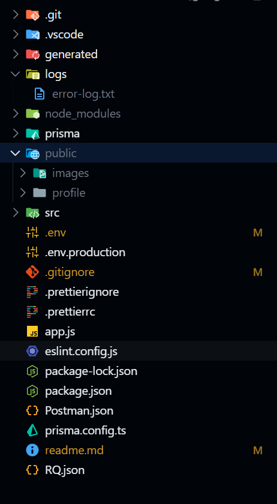

# ✈️ Travel Blog Backend (Express.js)

A simple **travel blogging backend** built with **Express.js**.
Users can register, log in, write travel blogs, edit/delete them, and update profiles with photo uploads.
Perfect if you’re exploring Express.js—or pretending you travel more than you actually do 😄

---

## 🚀 Getting Started

### Install Dependencies (one-time ritual)

```bash
npm install
```

### Run in Development

```bash
npm run dev
```

### Run in Production

```bash
npm run start
```

---

## 🗄️ Database Setup (MySQL)

1. Create a database named:

    ```
    travel-diaries-2026
    ```

2. Run the SQL scripts from:

    ```
    prisma/migrations/migration.sql
    ```

3. Sync Prisma:

    ```bash
    npm run db:sync
    ```

This will generate Prisma files inside `generated/prisma`.

---

## 🧩 Extra Goodies

- More commands live inside `package.json → scripts` (they’re self-explanatory, promise).
- Frontend available here 👉 [Travel Blogs Frontend](https://github.com/techiAbhil/travel-blogs-frontend)
- Dont want frontend? No worries.
    - `Postman.json` (Postman users)
    - `RQ.json` (Requestly users)
      Both the collections are ready to use from the root directory.

---

## 📁 Required Folders

Create these before running the app (future you will thank you):

```
/public
  ├── images
  └── profile
/logs
```

- The app will auto-create `logs/error-log.txt`
- Errors go there so your terminal can stay calm 😌

### Final folder structure



If you followed through all above guidelines you should be good to go, it it still did not work on you machine all I can say is `trust me it works on my machine!`
